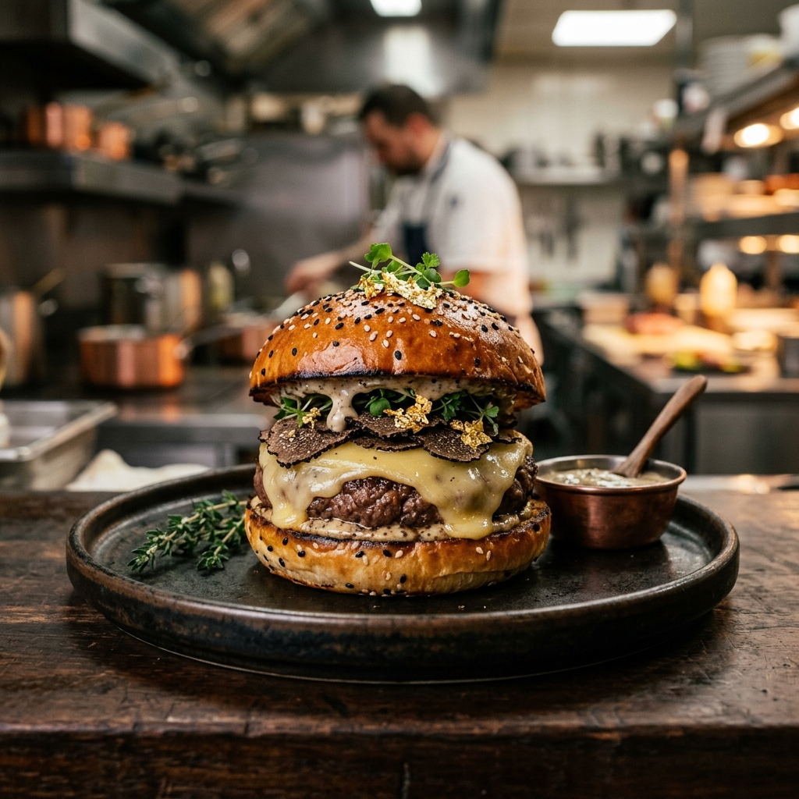

# 🛡️ Ghost Kitchen — Premium Culinary Node Template

A high-fidelity, production-grade HTML template designed specifically for **Ghost Kitchens**, **Virtual Restaurant Brands**, and **Cloud Dining Operations**. Engineered for speed, SEO, and premium aesthetic.

---

## 🚀 Vision
Ghost Kitchen bridges the gap between digital ordering and premium culinary experiences. It's not just a website; it's a digital storefront designed to convert visitors into loyal patrons through a "Digital First, Culinary Always" philosophy.

## ✨ Core Features
- **Premium Aesthetics**: Dark/Light mode support with smooth transitions.
- **RTL Support**: Full compatibility for right-to-left languages.
- **Micro-Animations**: Purpose-built scroll reveals and hover effects.
- **SEO Optimized**: Pre-configured meta tags, open-graph data, and semantic HTML5.
- **Performance**: 0-dependency architecture with locally hosted fonts and optimized assets.
- **Responsive**: Pixel-perfect layout across desktop, tablet, and mobile devices.

## 🛠️ Technology Stack
- **Structure**: Semantic HTML5
- **Styling**: Vanilla CSS3 (Custom Properties / Variables)
- **Logic**: Vanilla JavaScript (ES6+)
- **Typography**: Inter (Body) & Outfit (Heading)
- **Design System**: FORTIFIED v2 Standards

## 📂 Documentation Hub
For detailed guides, please refer to the files in the `/documentation` directory:

1.  **[Installation Guide](documentation/installation.md)** — Getting your site live.
2.  **[Page Structure](documentation/page-structure.md)** — Understanding the repository.
3.  **[Customization Guide](documentation/customization.md)** — Branding and styling.
4.  **[Changelog](documentation/changelog.md)** — Project history.
5.  **[Credits](documentation/credits.md)** — Assets and attributions.
6.  **[Support](documentation/support.md)** — Need help?

---
*Created with precision by Antigravity.*
